# ⚙📊**Introdução à Programação**📊⚙

- Este repositório é uma ajuda para entender as noções básicas da introdução para programação, o objetivo é ensinar **(ou lembrar)** os conceitos e fundamentos, incluindo a criação de conceitos básicos de linguagens de programação de alto nível: Tipos primitivos, Variáveis, atribuição, operadores, expressões. Sequenciamento de instruções. Controle de fluxo de execução: Estruturas de seleção e repetição.

## Objetivo Geral 🗃⚙
- Proporcionar aos leitores, os fundamentos da lógica de programação e o desenvolvimento de soluções computacionais, utilizando JavaScript como linguagem principal.

- Explicar de forma simples e acessível o que é o JavaScript e como utilizar funções para criar códigos mais organizados e reutilizáveis.

## Objetivos Específicos 🛠🗃⚙

- Compreender os princípios básicos da programação e algoritmos.
- Desenvolver raciocínio lógico aplicado à resolução de problemas computacionais.
- Aprender a manipular variáveis, estruturas de decisão, laços de repetição e funções em JavaScript.
- Criar aplicações básicas para web com JavaScript.
# Perguntas Frequentes 😬🙈🙉🙊

## **O que é o JavaScript?** 😎
- JavaScript é a linguagem de programação da web.
- Ele pode atualizar e alterar HTML e CSS.
- Ele pode calcular, manipular e validar dados.

## **O que é Função?** 😎
- Imagine que você tem uma tarefa repetitiva para realizar, como somar dois números ou calcular o IMC (ndice de Massa Corporal). Em vez de repetir o mesmo código toda vez que precisa, você pode criar uma função que executa essa tarefa por você.

#### - Em palavras simples:

- Uma função é como uma receita que você escreve uma vez e pode usar sempre que precisar.

- Você dá um nome para a função, explica o que ela faz e, quando precisar, “invoca” essa receita no seu código.

## **Qual a diferença entre VAR e LET?** 😎
- No javaScript está relacionada ao escopo, redeclaração, hoisting, e como essas variáveis se comportam no código.
- ``` var ```: Tem escopo de função, ou seja, é visível em toda a função onde foi declarada, independentemente de blocos internos como if, for, etc.
- ``` let ```: Tem escopo de bloco, ou seja, só é acessível dentro do bloco {} onde foi declarada.

#### Ex:
```
var a = 5;
var a = 10; // Funciona

let b = 5;
let b = 10; // Erro! Já foi declarada

```
# **Fundamentos de Programação e JavaScript**

## Estruturas de Controle
- Estruturas condicionais
- Laços de repetição
# 

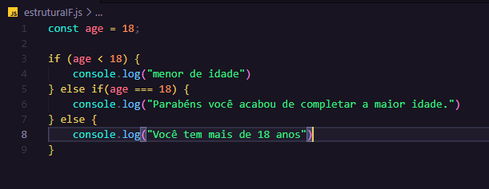
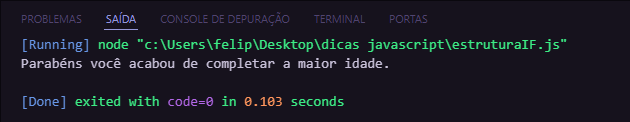

# 

## Funções e Modularidade
- Declaração e invocação de funções.
- Parâmetros e retorno de valores.
- Escopo de variáveis.
# 

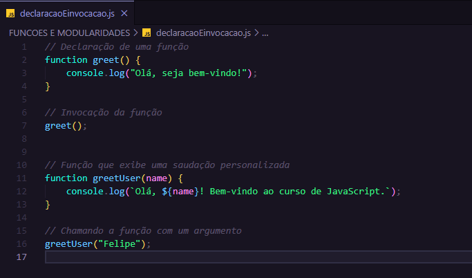
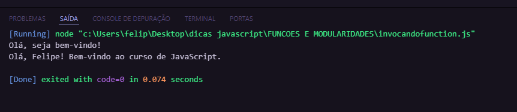

# 
# 

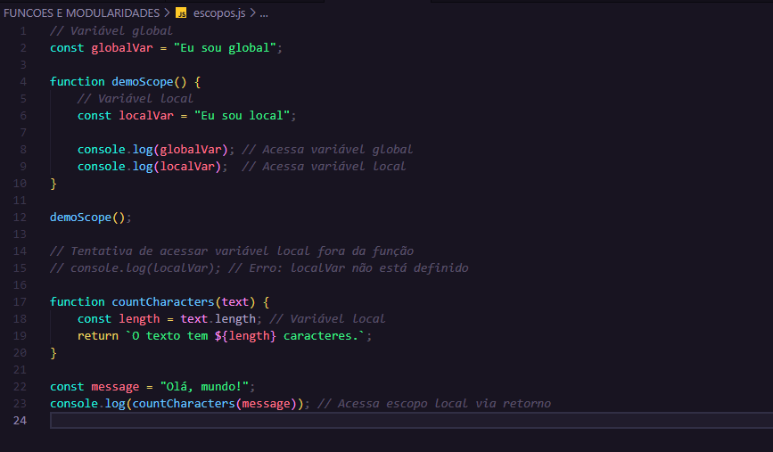


# 
# 

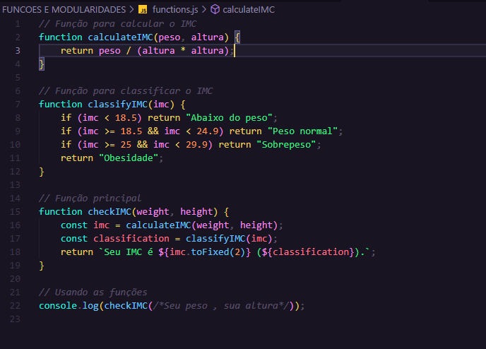


# 
# 

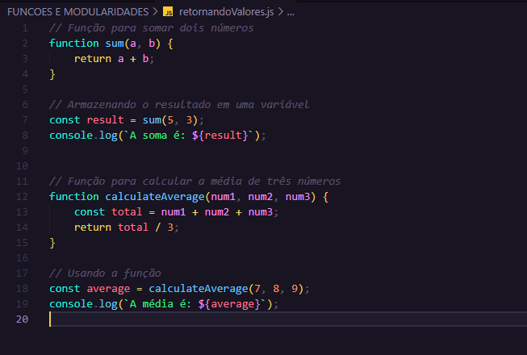
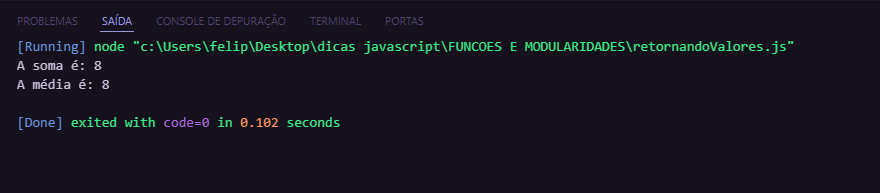

# 
## Manipulação do DOM
- Introdução ao Document Object Model (DOM).
- Seleção e manipulação de elementos HTML.
- Eventos em JavaScript.
# 

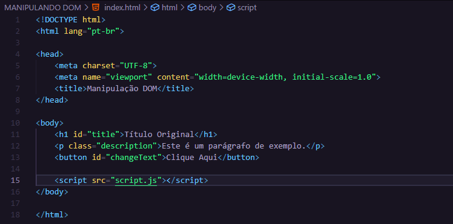


# 
## Aplicações Práticas
- Validação de formulários.
- Criação de interatividade em páginas web.
- Desenvolvimento de pequenos projetos aplicando os conhecimentos adquiridos.
# 

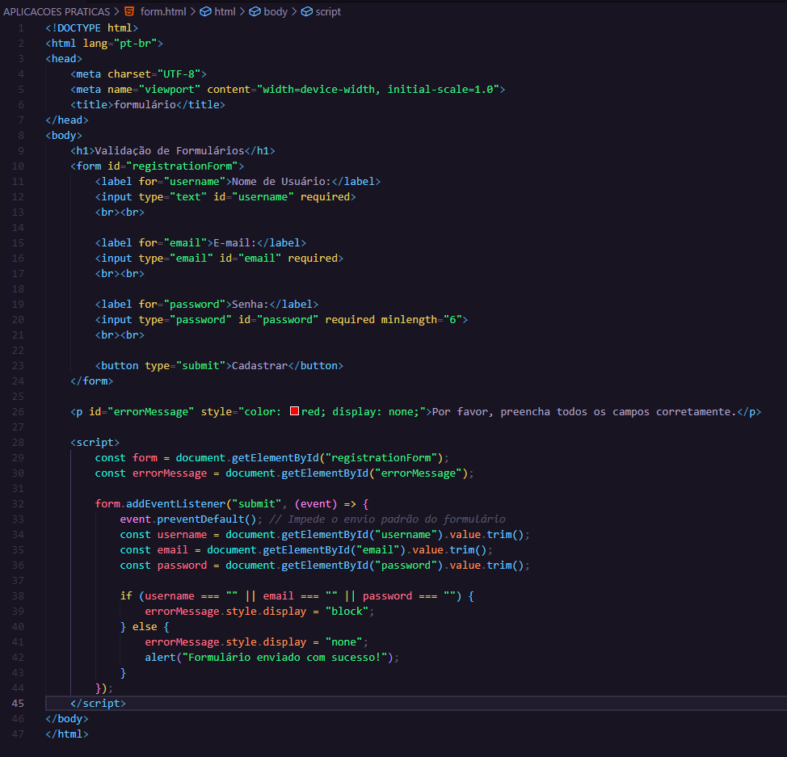
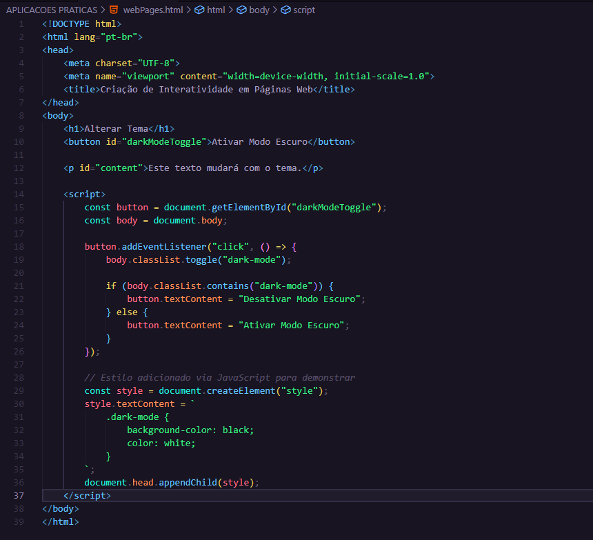
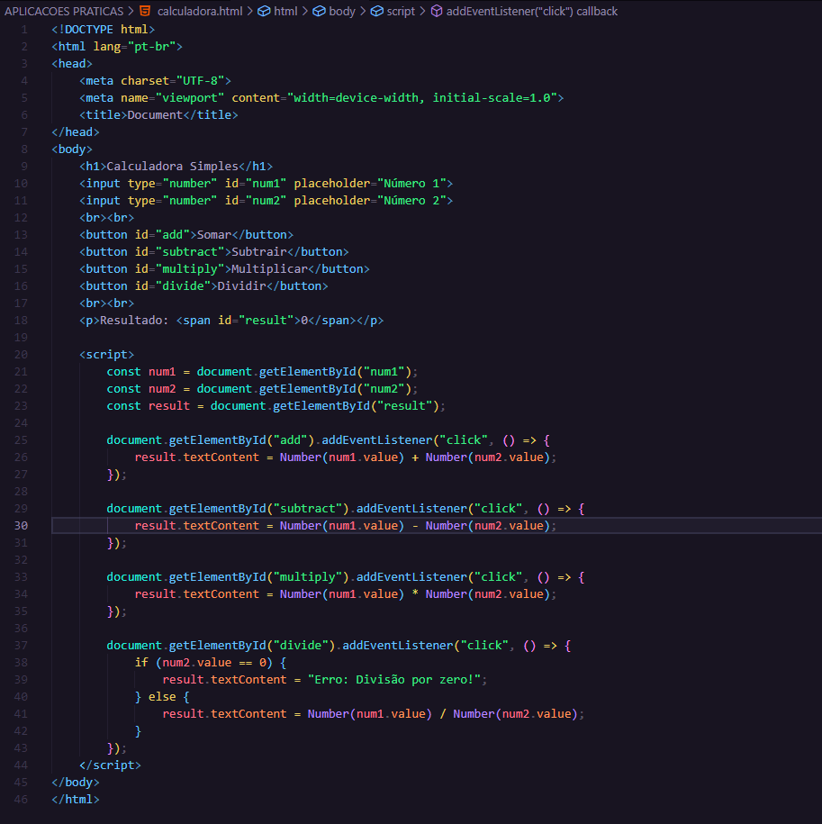

# 

# Obrigado! 😎

